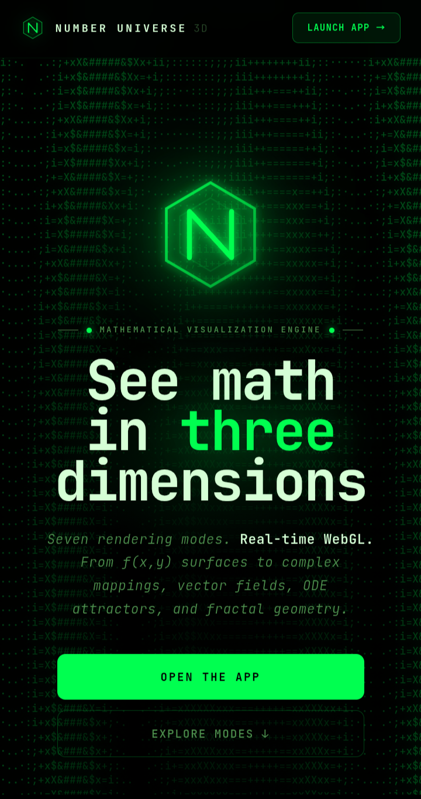

# Number Universe 3D

**A browser-based mathematical visualization engine — type an equation, see the geometry.**

[**Live Demo →**](https://nazat02.github.io/Number-Universe/)

---



## Overview

Number Universe 3D is a zero-install, WebGL-powered tool for exploring mathematics visually. It renders equations directly in 3D — from simple height maps to complex attractors and fractals — with real-time animation, interactive inspection, and shareable URLs. No build step, no dependencies to install, no account required.

---

## Features

| | |
|---|---|
| **7 Visualization Modes** | Function surfaces, complex mappings, parametric surfaces, space curves, vector fields, ODE attractors, fractal surfaces |
| **60 fps real-time animation** | Parameter `t` loops 0 → 2π live; surfaces update in-place without geometry rebuilds |
| **Cross-section slicer** | A draggable horizontal plane cuts through any surface with the Y-intercept shown live in the HUD |
| **Point inspector** | Click any point to see exact x, y, z coordinates and the evaluated function value |
| **Expression history** | Last 8 entered expressions are saved to localStorage and reloadable in one tap |
| **Screenshot export** | Full-resolution PNG exported directly from the WebGL canvas |
| **Shareable URL** | Mode and expression are encoded into the URL — paste it anywhere to share your visualization |
| **Variable resolution** | Resolution slider per mode, up to 100×100 (10,201 vertices) for publication-quality renders |

---

## Visualization Modes

### 1. Function Surface — `f(x, y)`
Plot any real-valued function of two variables. The full JavaScript `Math` API is in scope — `sin`, `cos`, `exp`, `log`, `pow`, `abs`, and more. Animate with parameter `t` in real time. Resolution adjustable from 16×16 up to 100×100.

```
sin(sqrt(x*x + y*y))          # classic wave ripple
cos(x) * sin(y)               # saddle-wave product
exp(-0.1*(x*x+y*y)) * sin(5*x)  # damped oscillation
```

### 2. Complex Mapping — `ℂ`
Visualizes complex functions as 3D height maps. Domain coloring encodes argument as hue and modulus as brightness. Built-in presets include z², z³, sin(z), exp(z), tan(z), and 1/z.

### 3. Parametric Surface
Classic surfaces defined by x(u,v), y(u,v), z(u,v). Includes torus, sphere, Klein bottle, Möbius strip, helicoid, catenoid, Enneper surface, and Boy's surface. Supports fully custom expressions up to 100×100 resolution.

### 4. Space Curves
Parametric 3D curves rendered as smooth tubes with 1200-point precision and per-vertex color gradients. Presets: trefoil knot, torus knot, Lissajous 3D, figure-8 knot, Viviani curve, epicycloid, cinquefoil.

### 5. Vector Field
3D arrow glyphs displaying direction and magnitude at each grid point. Presets include rotation, curl, sink, source, saddle, and tornado. Grid density adjustable from 3³ to 10³ points.

### 6. ODE Attractors
Chaotic dynamical systems integrated with Euler's method. Up to 40 simultaneous trajectories, color-mapped by time. Included systems:
- **Lorenz** — σ=10, ρ=28, β=8/3 (the butterfly attractor)
- **Rössler** — a=b=0.2, c=5.7
- **Duffing oscillator**
- **Thomas cyclically symmetric**

### 7. Fractal Surfaces
Escape-time iteration count mapped to a 3D height field. Presets:
- Mandelbrot set
- Burning Ship
- Julia set — c = −0.7+0.27i (connected)
- Julia set — c = −0.4+0.6i
- Newton fractal — z³−1

Up to 200 iterations per pixel.

---

## Usage

### Getting Started

1. Open [the app](https://nazat02.github.io/Number-Universe/)
2. Choose a mode from the tabs across the top
3. Type an expression — the surface updates as you type
4. Orbit, zoom, and inspect

### Controls

| Action | Input |
|---|---|
| Orbit | Click + drag |
| Zoom | Scroll wheel |
| Pan | Right-click + drag |
| Animate `t` | Click the clock icon |
| Cross-section | Click the slicer icon, drag slider |
| Inspect point | Click any point on the surface |
| Export PNG | Screenshot button |
| Share | Share button — copies URL to clipboard |

---

## Running Locally

No build step required. Clone the repository and open `index.html` in any modern browser.

```bash
git clone https://github.com/nazat02/Number-Universe.git
cd Number-Universe
open index.html
```

Or serve it locally to avoid any browser file-protocol restrictions:

```bash
# Python 3
python -m http.server 8000

# Node.js
npx serve .
```

Then visit `http://localhost:8000`.

---

## Project Structure

```
Number-Universe/
├── index.html        # Landing page — overview, modes, gallery
├── simulation.html   # The visualization engine (WebGL + Three.js)
└── LICENSE
```

The entire application is self-contained in two HTML files with no external dependencies beyond a CDN-loaded copy of Three.js r128 and Google Fonts.

---

## Tech Stack

| Layer | Technology |
|---|---|
| 3D Rendering | [Three.js r128](https://threejs.org/) via CDN |
| WebGL | Native browser WebGL |
| Math evaluation | JavaScript `Math` API (native, sandboxed) |
| Typography | JetBrains Mono, Inter (Google Fonts) |
| Hosting | GitHub Pages |

---

## Browser Support

Any modern browser with WebGL support:

- Chrome / Edge 80+
- Firefox 75+
- Safari 14+

Mobile browsers are supported. Touch drag to orbit, pinch to zoom.

---

## License

MIT © 2026 Md. Shaikhul Hadis Nazat

See [LICENSE](./LICENSE) for details.
